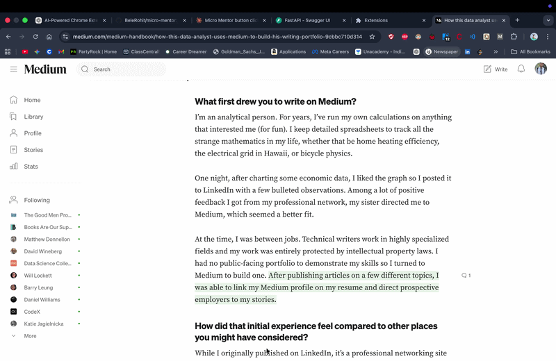

# Micro Mentor 🧠

Micro Mentor is a Chrome extension that transforms passive reading into active thinking.

Highlight any text on a webpage and instantly receive a single, Socratic-style question designed to deepen understanding — not explain, not summarize, but provoke thought.

Think of it as an invisible professor sitting quietly on your shoulder.

---

## ✨ Features

- Highlight any text on any webpage  
- Click the 🧠 icon or press Alt + M  
- Receive one AI-generated Socratic question  
- Lightweight floating UI overlay  
- Loading state (“Thinking...”)  
- Auto-dismiss bubble  
- Escape key to close  
- Click outside to dismiss  
- FastAPI backend with Groq LLM integration  

---

## 🧠 Philosophy

Most AI tools optimize for answers.

Micro Mentor optimizes for understanding.

Instead of explaining the highlighted content, it asks a sharp conceptual question that encourages active reasoning and long-term retention.

---

## 🏗 Architecture

Browser (Chrome Extension)  
↓  
Content Script (captures highlighted text)  
↓  
FastAPI Backend  
↓  
Groq LLM (OpenAI-compatible API)  
↓  
Socratic Question Returned  
↓  
Floating Mentor Bubble  

---

## 📁 Project Structure

micro-mentor/  
├── extension/  
│   ├── manifest.json  
│   ├── content.js  
│   └── styles.css  
├── backend/  
│   ├── main.py  
│   ├── requirements.txt  
│   └── .env  
└── README.md  

---

## 🚀 Setup Instructions

### 1. Clone Repository

git clone https://github.com/<your-username>/micro-mentor.git  
cd micro-mentor  

---

### 2. Backend Setup

cd backend  
python3 -m venv venv  
source venv/bin/activate  
pip install -r requirements.txt  

Create a `.env` file inside `backend/`:

GROQ_API_KEY=your_groq_api_key_here  

Run backend:

uvicorn main:app --reload  

Backend runs at:

http://localhost:8000  

---

### 3. Load Chrome Extension

1. Open Chrome  
2. Go to chrome://extensions  
3. Enable Developer mode  
4. Click Load unpacked  
5. Select the extension/ folder  

Extension is now active.

---

## 🧪 Usage

1. Open any webpage  
2. Highlight text  
3. Click the 🧠 icon or press Alt + M  
4. Read the Socratic question  
5. Reflect  

---

## 🔐 Environment Variables

Micro Mentor uses Groq’s OpenAI-compatible API.

Ensure `.env` contains:

GROQ_API_KEY=your_key_here  

Do NOT commit `.env` to version control.

---

## 🛠 Tech Stack

- Chrome Extension (Manifest V3)  
- Vanilla JavaScript  
- FastAPI  
- Groq LLM (OpenAI-compatible API)  
- Python  

---

## 🎯 Future Improvements

- Difficulty levels (Beginner / Advanced / Expert)  
- Question history panel  
- Local LLM fallback (Ollama)  
- Custom prompt tuning  
- User personalization  
- Chrome Web Store packaging  

---

## 📌 Status

MVP complete.  
Fully functional Chrome extension with AI backend.

---

## 📄 License

MIT